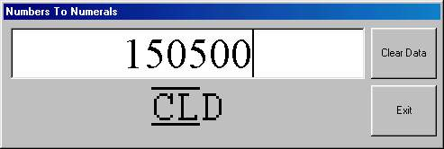



## Numerals

### Description

Revised Roman Numeral generator. This version will in theory generate numbers in excess of 1000000 using the standard numbering conventions, i.e. 5000 is equal to a V with a line above and below..
 
### More Info
 
This code relies on the user NOT using True Type fonts. The problem lies in getting the lines to appear above and below the letters, as I couldn't find a font that did this I've cheated and simply used two labels. Look at teh code and you'll see what I mean.

             |
---                |---
**Submitted On**   |2000-02-26 13:21:26
**By**             |[Mark Darlison](https://github.com/Planet-Source-Code/PSCIndex/blob/master/ByAuthor/mark-darlison.md)
**Level**          |Beginner
**User Rating**    |2.8 (14 globes from 5 users)
**Compatibility**  |VB 4\.0 \(32\-bit\), VB 5\.0, VB 6\.0
**Category**       |[String Manipulation](https://github.com/Planet-Source-Code/PSCIndex/blob/master/ByCategory/string-manipulation__1-5.md)
**World**          |[Visual Basic](https://github.com/Planet-Source-Code/PSCIndex/blob/master/ByWorld/visual-basic.md)
**Archive File**   |[CODE\_UPLOAD36232262000\.zip](https://github.com/Planet-Source-Code/mark-darlison-numerals__1-6274/archive/master.zip)

